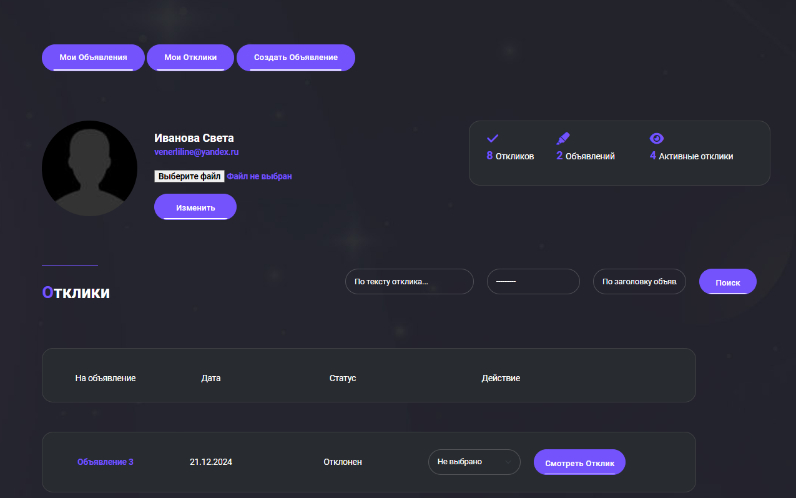

# Интернет ресурс для одной известной MMORPG

## Содержание
- [Описание](#описание)
- [Возможности интернет ресурса](#возможности-интернет-ресурса)
- [Установка, настройка и запуск](#установка-настройка-и-запуск)
- [Файловая структура проекта](#файловая-структура-проекта)

## Стек технологий
- python 3.8
- django 4.2.15
- django-allauth 65.0.0
- django-summernote 0.8.20.0
- redis 5.1.1
- celery 5.4.0

---
## Описание
Данный проект был реализован в рамках задачи "Интернет-форум для фанатского 
сервера MMORPG". \
Цель, познакомиться с фреймворком django, его возможности, оссобенностями и подчеркнуть 
для себя что-то новое.

**Техническое задание** \
*Разработать интернет-ресурс для фанатского сервера одной известной MMORPG — что-то вроде 
доски объявлений. Пользователи ресурса должны иметь возможность зарегистрироваться в нём по e-mail, 
получив письмо с кодом подтверждения регистрации. После регистрации им становится доступно создание 
и редактирование объявлений. Объявления состоят из заголовка и текста, внутри которого могут быть 
картинки, встроенные видео и другой контент. Пользователи могут отправлять отклики на объявления 
других пользователей, состоящие из простого текста. При отправке отклика пользователь должен получить 
e-mail с оповещением о нём. Также пользователю должна быть доступна приватная страница с откликами на 
его объявления, внутри которой он может фильтровать отклики по объявлениям, удалять их и принимать 
(при принятии отклика пользователю, оставившему отклик, также должно прийти уведомление). Кроме того, 
пользователь обязательно должен определить объявление в одну из следующих категорий: 
Танки, Хилы, ДД, Торговцы, Гилдмастеры, Квестгиверы, Кузнецы, Кожевники, Зельевары, 
Мастера заклинаний.*
Также мы бы хотели иметь возможность отправлять пользователям новостные рассылки.

Для интереса, в проект был подключен bootstrap 5 шаблон найденый на просторах интернета и 
дополнительно добавлен контекст для новостей, чтобы проверить работоспособность (новости также 
были найды в интернете). 

---
### Возможности интернет ресурса
- Регистрация на портале с подтверждением адреса электронной почты по коду 
- Просмотр новостей

После регистрации доступно:
- Создание и редактирование объявлений
- Отправка откликов на объявления других пользователей
- Личный кабинет
- E-mail рассылка новостей и отправка уведомлений при определенных действиях

#### Главная страница и Новости

#### Раздел c Объявлениями

#### Личный кабинет. Возможности

Пользователю доступна загрузка фото профиля и 
Рядам с ним есть "панель" в которой собрана небольшая статистика:

**Отклики** - Количество откликов, которые оставил пользователь \
**Объявления** - Количество объявлений созданных пользователем \
**Активные отклики**  - И количество непринятых откликов. 
Это отклики, которые оставили другие пользователи и которые нужно обработать (принять, отклонить)

#### Личный кабинет. Отклики и что с ними можно делать
По умолчанию отклики записываются в БД со статусом "Новый". Их можно принять, отклонить и удалить. \
**!!!**
**Смена статуса происходит при нажатии на элемент из выподающего списка**
**!!!**

Посте принятия или отклонения будет доступно только 1 действие - удалить.

При нажатии на кнопку **"Смотреть отклик"** ниже отклика появится блок с автором отклика 
и текст отклика.

#### Личный кабинет. Раздел с объявлениями

В данном разделе отображаются объявления созданные пользователем. \
При нажатии на кнопку "Редактировать", произойдет переход в раздел, где можно будет отредактировать
объявление. А при нажатии на кнопку "Удалить" - объявление будет просто удалено.

#### Администрирование
В django admin были добавлены все модели проекта для контролирования контентом ресурса.

#### Рассылка уведомлений
Уведомленя настроены с помощью django signals. \
Первый сигнал срабатывает при создании нового отклика и отправляет уведомление автору объявления. \
Второй сигнал сработает, когда у отклика поменяется статус и только если он будет равен "Принят".
Уведомление отправится создателю отклика. \
Также есть 1 периодическая задача на еженедельную рассылку новостей (Новости отправляются всем 
пользователям, которые находятся в группе postsletter).

---
## Установка, настройка и запуск
1. Убедитесь, что у вас установлен python версии 3.8.
2. Клонируйте этот репозиторий: `https://github.com/SvetlanaKrasnova/online_forum_mmorpg.git`
3. Установить необходимые библиотеки из файла requirements.txt `pip install -r requirements.txt`
4. Настройте конфиг (.env).
5. Настройка базы данных (необязательный шаг). В проекте лежит бд sqlite3 с минимальными данными для демонстрации
работы проекта
6. Выполните команду `python manage.py runserver`

Для **запуска рассылки новостей**, необходимо запустить celery и выполнить команды: \
`celery -A online_forum_mmorpg worker -l INFO --pool=solo` \
`celery -A online_forum_mmorpg beat -l INFO`

.env: \
Необходимо прописать следующие настройки для отправки уведомлений: \
**DEFAULT_FROM_EMAIL** \
**EMAIL_HOST_USER** \
**EMAIL_HOST_PASSWORD** \
**SERVER_EMAIL** \
**EMAIL_ADMIN** 

## Файловая структура проекта
~~~python
online_forum_mmorpg/
├── files_readme/ # Файлы для README.md
├── online_forum_mmorpg/
│   ├── __init__.py
│   ├── cache_files/
│   │   ├── ...
│   ├── db.sqlite3
│   ├── manage.py
│   ├── media/
│   │   ├── default_avatar/
│   │   │   └── single-author.jpg # аватар профиля по умолчанию (нет фото)
│   │   ├── profile_images/ # фото профиля
│   │   │   ├── ...
│   │   └── uploads/ # сюда попадают файлы от django-summernote (изображения/видео 
                     # от объявлений и новостей)
│   │       ├── ...
│   ├── news/ # Приложение Новости
│   │   ├── __init__.py
│   │   ├── admin.py
│   │   ├── apps.py
│   │   ├── filters.py
│   │   ├── management/
│   │   │   └── commands/
│   │   │       └── get_user_postsletter.py # Тестовая команда для просмотра кто в группе 
                                            # для рассылки новостей
│   │   ├── migrations/
│   │   │   ├── ...
│   │   ├── models.py
│   │   ├── tasks.py # тут задача на еженедельную рассылку новостей
│   │   ├── urls.py
│   │   └── views.py
│   ├── online_forum_mmorpg/
│   │   ├── __init__.py
│   │   ├── asgi.py
│   │   ├── celery.py
│   │   ├── settings.py
│   │   ├── storage.py # Переопределение класса для сохранения вложений в папку media/uploads
│   │   ├── urls.py
│   │   ├── utils/
│   │   │   ├── __init__.py
│   │   │   ├── notification.py # Единый метот по отправке уведомлений на почту
│   │   │   └── parser_html.py # Парсер от html тэгов
│   │   └── wsgi.py
│   ├── posts/ # Приложение для объявлений
│   │   ├── __init__.py
│   │   ├── admin.py
│   │   ├── apps.py
│   │   ├── filters.py
│   │   ├── forms.py
│   │   ├── migrations/ 
│   │   │   ├──...
│   │   ├── models.py
│   │   ├── signals.py
│   │   ├── templatetags/
│   │   │   ├── custom_filters.py
│   │   │   └── custom_tags.py
│   │   ├── urls.py
│   │   └── views.py
│   ├── sign/ # Профиль пользователя
│   │   ├── __init__.py
│   │   ├── admin.py
│   │   ├── apps.py
│   │   ├── forms.py
│   │   ├── migrations/
│   │   │   ├── ...
│   │   ├── models.py
│   │   ├── signals.py
│   │   ├── urls.py
│   │   └── views.py
│   ├── static/
│   └── templates/
│       ├── account/
│       │   ├── confirm_email_verification_code.html
│       │   ├── login.html
│       │   └── signup.html
│       ├── allauth/
│       │   └── layouts/
│       │       └── base.html
│       ├── default.html
│       ├── main_page.html
│       ├── navbar.html
│       ├── news/
│       │   └── notify_week_news_mail.html # Шаблон для email- рассылки новостей
│       ├── pagination.html
│       ├── posts/
│       │   ├── create_post.html
│       │   ├── detail_post.html
│       │   └── posts.html
│       └── sign/
│           ├── notify_reply.html # Шаблон для email-уведомления о новом отклики и его принятии
│           ├── profile.html
│           ├── profile_my_posts.html
│           └── profile_my_replies.html
├── README.md
├── requirements.txt
~~~
    